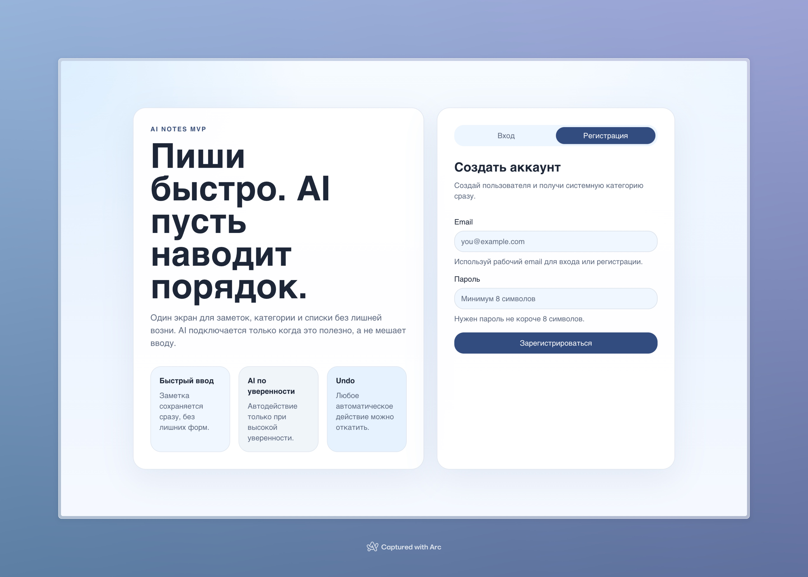
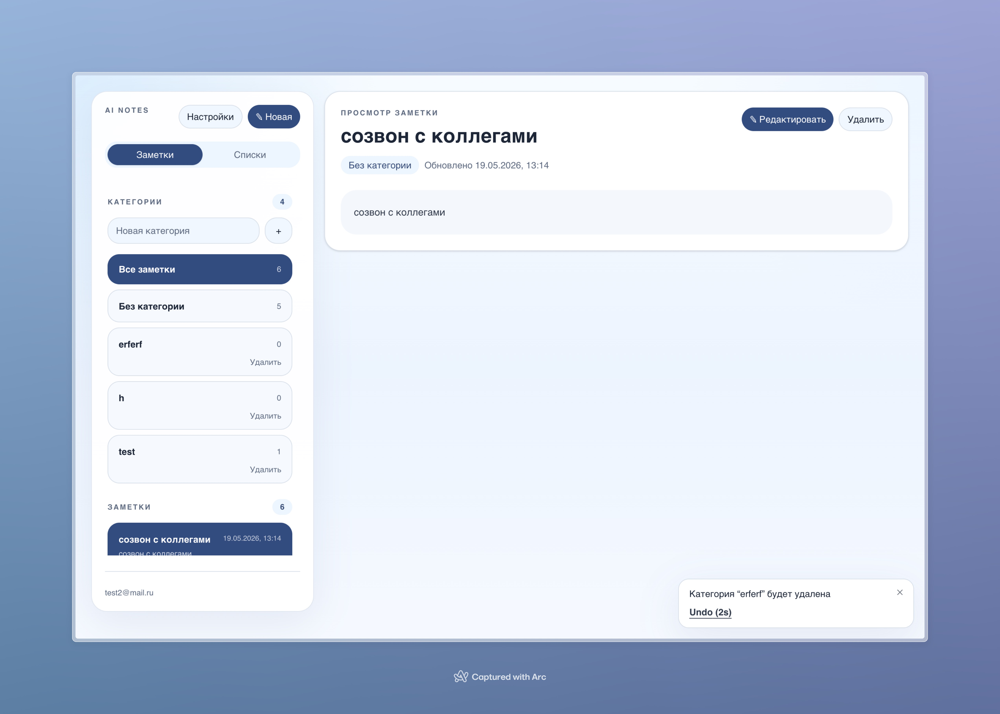
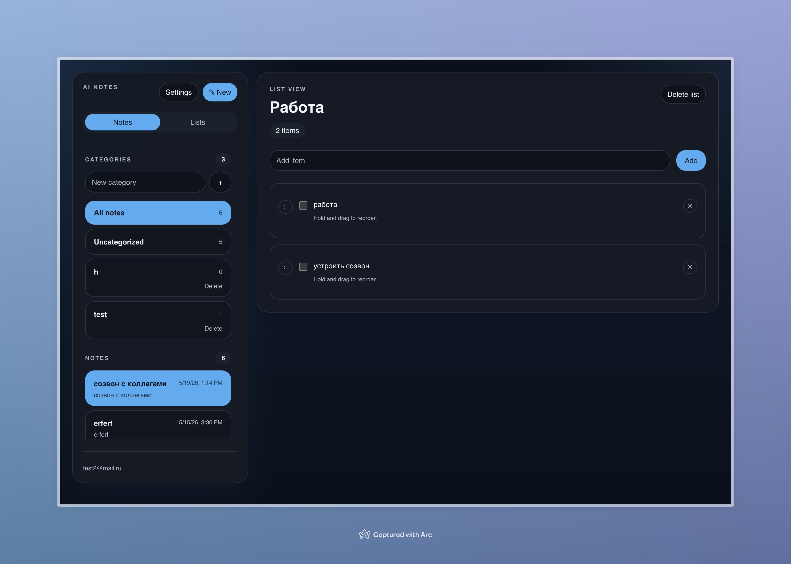
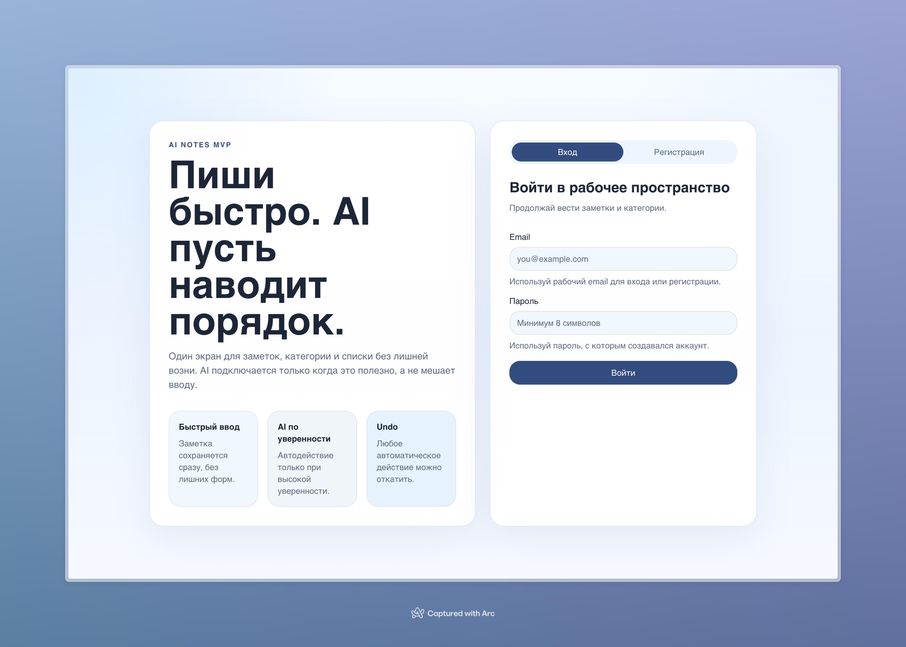

# AI Notes

## Скриншот работы и описание

`AI Notes` — fullstack-приложение для быстрых заметок с AI-помощником. Пользователь может создавать и редактировать заметки, раскладывать их по категориям, вести списки и получать AI-предложения по организации записей.

AI анализирует заметку после сохранения и в зависимости от уверенности:

- автоматически назначает категорию
- предлагает действие вручную
- превращает заметку в пункт существующего списка

Также в приложении есть `Undo` для AI-действий и удалений, тёмная тема, локализация `ru/en` и пользовательский `OpenAI API key` в настройках.

### Экран авторизации

### Экран заметок

### Экран списков

### Создание заметки

## Фичи

- регистрация и вход через `JWT`
- создание, редактирование и удаление заметок
- autosave заметок
- категории с системной `Без категории`
- списки с `drag-and-drop` reorder
- защита от дублей для категорий и пунктов списка
- AI-классификация заметок через `OpenAI API`
- `auto apply / suggestion / no-op` по threshold logic
- `Undo` для AI-действий
- `Undo` для destructive-действий в интерфейсе
- тёмная и светлая тема
- русский и английский язык интерфейса
- frontend и backend тесты
- `Playwright e2e` smoke test
- `CI` через `GitHub Actions`

## Быстрый запуск

1. Скопировать env-файлы:
   - `cp backend/.env.example backend/.env`
   - `cp frontend/.env.example frontend/.env`
2. Поднять PostgreSQL:
   - `docker compose up -d db`
3. Установить зависимости:
   - `npm install`
4. Сгенерировать Prisma client и применить миграции:
   - `npm run prisma:generate`
   - `npm run prisma:migrate`
5. Запустить backend:
   - `npm run dev:backend`
6. Запустить frontend:
   - `npm run dev:frontend`
